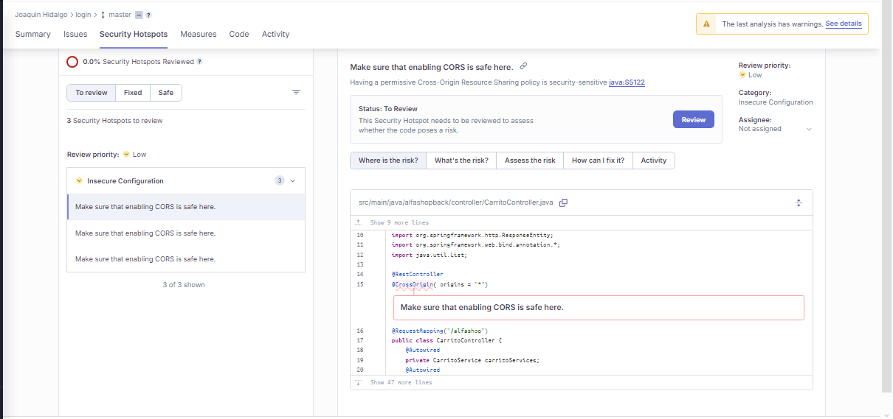

# Alfashop_Example
- Ejemplo de proyecto desarrollado en Java Spring boot
- Correciones realizadas con SonnarLint en Intelij
- Alumno: Joaquin Hidalgo Cock
- Curso Verificacion y Validacion
## Correciones
1) **Correción 1:** *Code Smell*, problemas de confiabilidad mantenibilidad 
   - Version antigua
   ```
   public class CompradorController{
    @Autowired
    private CompradorService compradorService;
    @Autowired
    private AutenticacionService autenticacionService;
    @Autowired
    private BCryptPasswordEncoder bCryptPasswordEncoder;
   }
    ```
   - Nueva Version (Solucion Sin implementar Lombok)
   ```
       public class CompradorController {
    
        private final CompradorService compradorService;
        private final AutenticacionService autenticacionService;
        private final BCryptPasswordEncoder bCryptPasswordEncoder;

        public CompradorController(CompradorService compradorService, AutenticacionService autenticacionService, BCryptPasswordEncoder bCryptPasswordEncoder) {
            this.compradorService = compradorService;
            this.autenticacionService = autenticacionService;
            this.bCryptPasswordEncoder = bCryptPasswordEncoder;
        }
     }
   ```  
2) **Correción 2:** *Code Smell*, problemas de confiabilidad
    - Version Antigua
   ```
   public class CompradorController{
    @PutMapping("/usuario/{id_usuario}")
    public Comprador modificar(@RequestBody Comprador comprador, @PathVariable Integer id) {
      Comprador compradorActual = compradorService.findById(id);
      compradorActual.setNombres(comprador.getNombres());
      compradorActual.setApellidos(comprador.getApellidos());
      compradorActual.setTelefono(comprador.getTelefono());
      compradorActual.setCorreo(comprador.getCorreo());
      compradorActual.setContrasenia(comprador.getContrasenia());
      compradorActual.setFechaNacimiento(comprador.getFechaNacimiento());

      return compradorService.save(compradorActual);
    }
   }
   ```
   - Version Nueva
   ```
   public class CompradorController{
    @PutMapping("/usuario/{id_usuario}")
    public Comprador modificar(
      @RequestBody Comprador comprador,
      @PathVariable("id_usuario") Integer id
    ) {
      Comprador compradorActual = compradorService.findById(id);
      compradorActual.setNombres(comprador.getNombres());
      compradorActual.setApellidos(comprador.getApellidos());
      compradorActual.setTelefono(comprador.getTelefono());
      compradorActual.setCorreo(comprador.getCorreo());
      compradorActual.setContrasenia(comprador.getContrasenia());
      compradorActual.setFechaNacimiento(comprador.getFechaNacimiento());
      
      return compradorService.save(compradorActual);
    }
   }
   ```
3) **Correción 3:** *Code Smell*, problemas de matenibilidad
   - Version Antigua
      ```
     public class CompradorImplementServirce implements CompradorService {
      public List<Comprador> findAll() {
        return (List<Comprador>) compradorRepository.findAll();
      }
     }
     ```
   - Version Nueva
     ```
     public class CompradorImplementServirce implements CompradorService {
      public List<Comprador> findAll() {
        return compradorRepository.findAll();
      }
     }
     ```
4) **Correción 4:** *Security Hotspot*, problemas de seguridad
    - Version Antigua
    ```
    spring.datasource.username=root
    spring.datasource.password=Alfashop_123        
    ```
    - Version Nueva
    ```
    spring.datasource.username=${DB_USER}
    spring.datasource.password=${DB_PASSWORD}
    ```
5) **Correción 4:** *Security Hotspot*, problemas de seguridad
    - Version Antigua
    ```
    @RestController
    @CrossOrigin(origins = "*")
    @RequestMapping("/alfashop")
    @AllArgsConstructor
    public class ProductoController {
    }       
    ```
    - Version Nueva
    ```
    @RestController
    @CrossOrigin(origins = "http://localhost:5173")
    @RequestMapping("/alfashop")
    @AllArgsConstructor
    public class ProductoController {
    }   
    ```
## Reporte de Analisis Estatico Sonnar
### Reporte de sonar de codigo con problemas

  - **Problemas de Mantenibilidad**
  
  - **Problemas de Seguridad**
  
  - **Problemas de Confabilidad**
  
### Reporte de sonar de codigo sin problemas
  